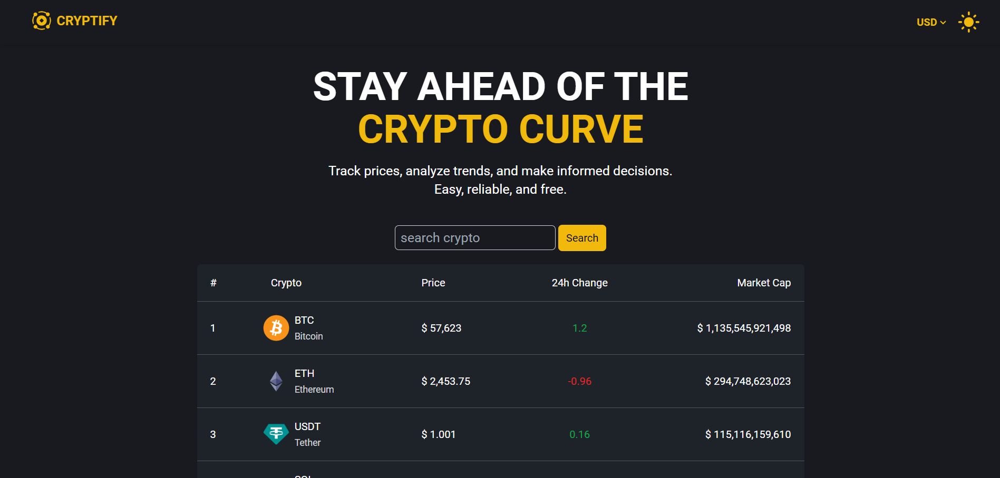

<h1 align="center">🌟 Cryptify Crypto Tracker Website 🌟</h1>

## Overview

This project is an intuitive platform for tracking cryptocurrency prices, designed using React and Tailwind CSS. The application fetches real-time data from the CoinGecko API, listing over 100 cryptocurrencies with their respective prices, 24-hour changes, and market caps. Users can efficiently browse the data using pagination and search functionality, and view prices and market caps in USD, EUR, and INR.



## Demo

### [Cryptify](https://cryptify-blue.vercel.app/)

## Features

- 📊 Real-Time Data fetching from CoinGecko API
- 💹 Comprehensive Listings of over 100 cryptocurrencies
- 💵 View prices and market caps in USD, EUR, and INR
- 🔍 Efficient browsing with search and pagination features
- 🔄 Dynamic Routing for Detailed information of each cryptocurrency.
- 📈 A 7-day price history chart for each cryptocurrency
- 🎨 Dark mode to enhance user experience
- 📱 Responsive Design

## Installation:

1. Clone this repository :

```bash
git clone https://github.com/MuneerHashmat/cryptify.git
```

2. Navigate to the folder: `cd cryptify`
3. Install the dependencies: `npm install`
4. Start development server: `npm run dev`


## Tech Stack

- ⚛️ React
- ⚡ Vite
- 🎨 Tailwind CSS
- 🌐 CoinGecko API


## API Documentation

### Github repository
**[Cryptify API](https://github.com/MuneerHashmat/cryptify-proxy-server.git)**


### Base url
```
https://cryptify.up.railway.app/
```

## Endpoints

1. **All cryptocurrencies** 

```
GET /api/v1/all-cryptos/:currency
```
currency options: usd, eur, inr

1. **Cryptocurrency detail by id** 

```
/api/v1/crypto-detail/:id
```

1. **Cryptocurrency historical prices by id** 

```
GET /api/v1/crypto-historical-data/:id/:currency
```